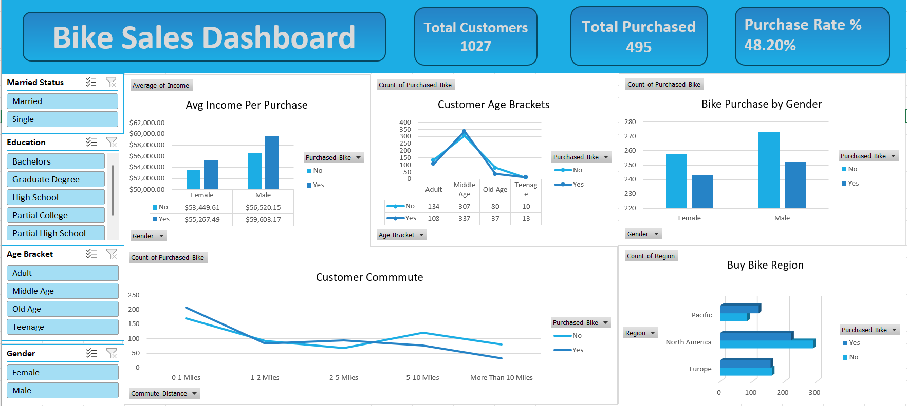

# 🚴 Bike Sales Dashboard

## 📌 Project Overview

This project is an interactive Bike Sales Dashboard built in Microsoft Excel to analyze customer purchasing behavior using demographic and regional data. The dashboard provides valuable business insights through KPIs, Pivot Tables, Pivot Charts, and interactive Slicers.

---

## 🎯 Objectives

- Analyze bike purchase trends.
- Understand customer demographics.
- Compare purchasing behavior across regions.
- Identify the impact of income and commute distance on bike purchases.
- Build an interactive dashboard for business decision-making.

---

## 📊 Dashboard Features

- Total Customers KPI
- Total Purchased KPI
- Purchase Rate KPI
- Average Income Analysis
- Customer Age Analysis
- Bike Purchase by Gender
- Commute Distance Analysis
- Regional Analysis
- Interactive Slicers
  - Gender
  - Marital Status
  - Education
  - Region
  - Age Bracket

---

## 🛠 Tools & Technologies

- Microsoft Excel
- Pivot Tables
- Pivot Charts
- Slicers
- Dashboard Design
- Conditional Formatting

---

## 📈 Key Insights

- Male customers purchased more bikes than female customers.
- Middle-aged customers showed higher purchase rates.
- Higher income groups purchased more bikes.
- Purchase trends vary across different regions.
- Interactive filters allow dynamic data exploration.

---

## 💡 Skills Demonstrated

- Data Cleaning
- Data Analysis
- Data Visualization
- Dashboard Development
- KPI Reporting
- Business Intelligence

---

## 📷 Dashboard Preview

